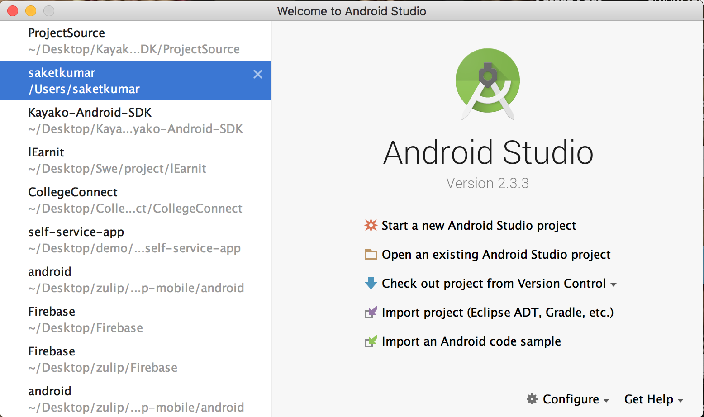
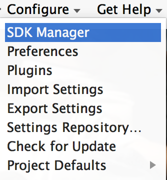
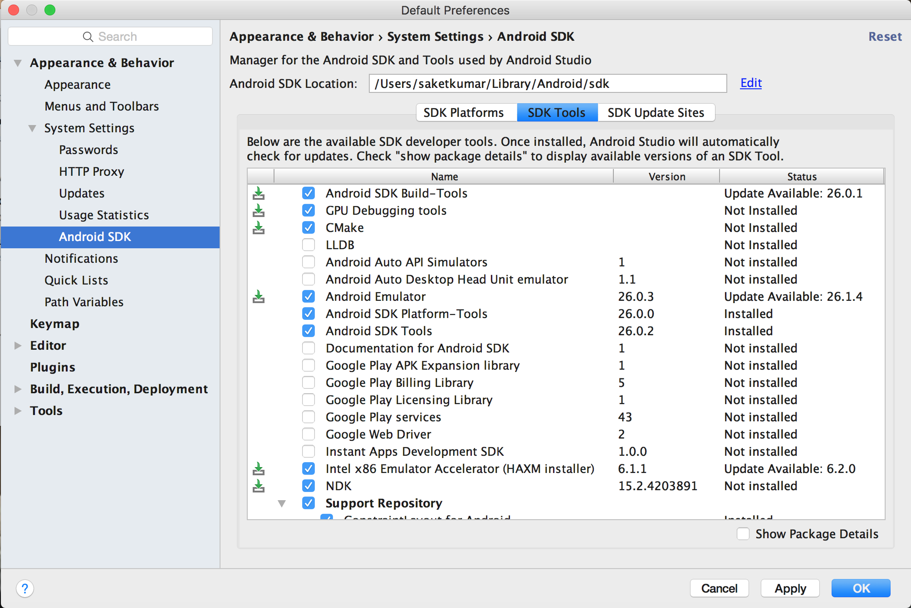
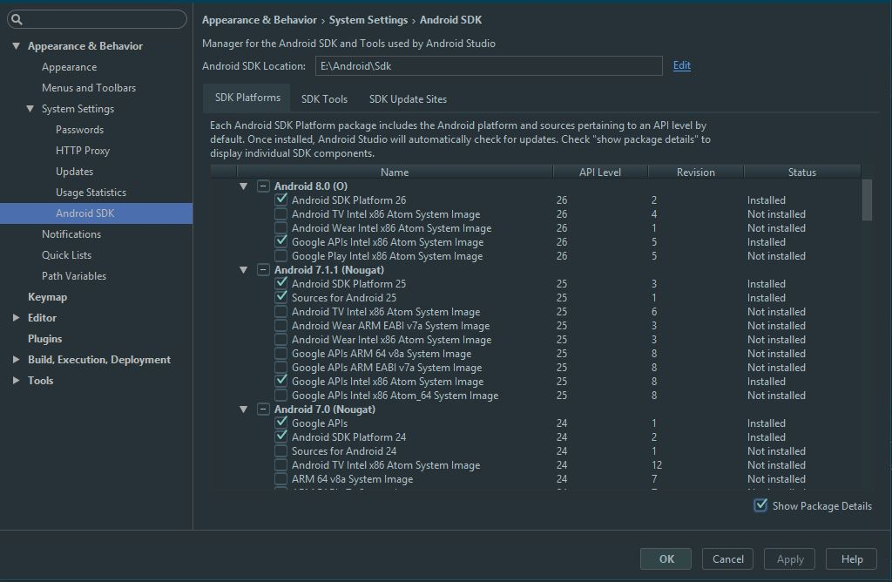
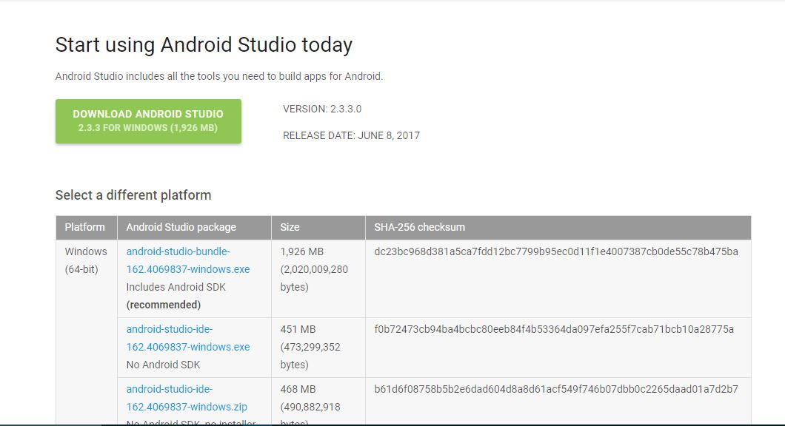
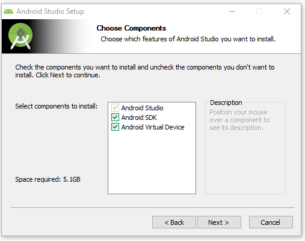
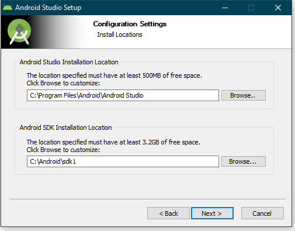

# Android Studio Installation

## Why Android development?

There are over 1 billion Android devices active and 2.2 million android apps on Play Store today. Android represents an incredible opportunity for developers. Android applications can be developed both in Android Studio and Eclipse, which are both IDEs. However, Android Studio is the official IDE for app development by Google, so it is highly recommended to use Android Studio for development.

## Quick Overview

An android app is written in XML for the frontend UI and JAVA for the backend.

All the backend part is done using Java. But now, Kotlin Language is declared for Official by Google for Android development.Although it’s not a big deal to switch to Kotlin as If you know any object oriented programming language, then it will not be much difficult to relate to the concepts used during development. In short if you know C++ then also you are at peace.

The frontend part is done using XML. All user interface elements in an Android app are built using View and ViewGroup objects. 

## Installation of Android Studio

JDK and JRE are essential for JAVA to run on your machine.

### For Linux Users :

#### Installing JAVA : 

Open up your Terminal (Alt + Shift + T) for Mac or (Ctrl + Alt + T) for Linux and follow the below commands to install JDK and JRE.

##### Step 1: Update package list

`sudo apt-get update`

##### Step 2: Install JRE and JDK

`sudo apt-get install default-jre  default-jdk  oracle-java8-installer`

##### Step 3: Configure Java

`sudo update-alternatives --config java`

##### Step 4: Set environment variable replacing YOUR_PATH with path which last command returned

`sudo vim /etc/environment – add JAVA_HOME="YOUR_PATH"`

##### Step 5:

`source /etc/environment`

Visit this [link](https://www.digitalocean.com/community/tutorials/how-to-install-java-on-ubuntu-with-apt-get) for any reference.

#### Installing IDE

1. Follow this [link](https://developer.android.com/studio/index.html) and select all the packages for linux. This will download the zip file.

2. Extract the file.

3. In terminal type: 
`cd /{Location where you extracted the zip file}/android-studio/bin` and then `sh studio.sh`

This will open up the android studio. Somewhat similar to below would appear. Select configure in it.

Click on the SDK Manager icon 

Now the below window will appear. Install the ticked packages shown in the below image. Installing the Native Development Kit(NDK) is mandatory if you want to develop using C++.

Select the below checked boxes to install the Android Software Development Kit for different platforms of Android. If you can't see the individual packages, tick the check-box in the bottom right corner titled "Show Package Details".

Now let the packages download and install themselves, after which click "Done".

Now you can make new projects using the "New Project" option from the "File" drop-down menu, or from the "Start a new Android Project" button.

### For Windows users:

JDK and JRE are essential for JAVA to run on your machine.

#### Installing JAVA

1. Go [here](http://www.oracle.com/technetwork/java/javase/downloads/jdk8-downloads-2133151.html) and download the correct verion for your Windows (32-bit or 64-bit) from the <b> Java SE Development Kit </b> section.
2. Now, go [here](http://www.oracle.com/technetwork/java/javase/downloads/jre8-downloads-2133155.html) and download the correct file under the <b> Java SE Runtime Environment </b>.
3. Install both the packages.
4. It is advised to install the above packages at the default directories appearing in the installer.

#### Installing Android Studio

[Download](https://developer.android.com/studio/index.html#downloads) the latest version of Android Studio available which includes the Android SDK.

Now, run the installer. Give the installer administrative privileges when prompted.

Click <i> Next </i> at the initial window.

Check all the boxes and click <i> Next </i>.

Read the License Agreement if you want, and then click <i> I Agree </i> if you agree, otherwise you can go the hard way and use Eclipse.

At the <b> Installation Location </b> screen, click <i> Next </i>, or if you have less space in your C: drive, install the SDK at some other location, preferably replacing the C in the installation address with some other drive letter.

Click <i> Install </i>.

